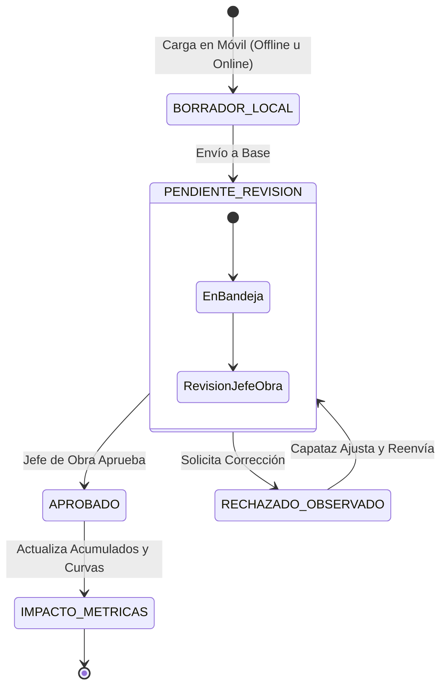

# Documento de Requisitos del Producto (PRD)
## Plataforma de Reportes y Seguimiento de Obra en Campo (Vaca Muerta)

---

## 1. Visión General del Producto

### 1.1 Contexto y Oportunidad
Las empresas constructoras y de servicios en **Vaca Muerta (Neuquén)** operan en locaciones remotas y hostiles con:
- Dispersión geográfica de frentes de obra.
- Conectividad móvil intermitente o nula en locación.
- Personal operativo (capataces, cuadrillas) con poco tiempo y condiciones físicas complejas (uso de guantes, viento, polvo).
- Retraso en la llegada de información a la oficina central (base).

### 1.2 Propuesta de Valor y Estrategia
Una plataforma ágil y minimalista que permite capturar el avance diario de tareas preconfiguradas mediante:
1. **PWA Móvil (Canal Principal Fase 1):** Una interfaz web táctil ultra-simple, con soporte offline, grabación de voz directa, carga rápida de métricas (+50m, +100m, checks), fotos con GPS y notas de campo.
2. **Canal WhatsApp + IA (Fase 2 / Complementaria):** Integración para recibir notas de voz por WhatsApp y extraer los avances automáticamente.
3. **Flujo de Validación y Aprobación en Base:** Todo reporte ingresa en estado `PENDIENTE_REVISION` antes de que el Jefe de Obra apruebe el impacto en las métricas y curvas de avance oficiales.

---

## 2. Benchmark del Mercado: Aplicaciones Existentes

Analizamos las principales soluciones en el mercado global y regional para identificar ventajas competitivas:

| Aplicación / Plataforma | Enfoque Principal | Pros / Fortalezas | Contras / Limitaciones para Vaca Muerta |
| :--- | :--- | :--- | :--- |
| **BuildLog AI** *(Global)* | Bitácora de voz con IA y modo offline | Dictado por voz, preserva audio original, fotos GPS | Enfocado en mercado anglosajón, no adaptado a jerga local de yacimientos argentinos |
| **ObraFlow** *(Latam / Arg)* | Reportes vía WhatsApp con IA | No requiere instalar apps, usa WhatsApp existente | Dependencia de conexión continua para chat, no tiene UI dedicada para ver tareas pendientes |
| **Raken** *(Global)* | App móvil de partes diarios líder | Excelente UX móvil, reportes en PDF profesionales | Muy costosa en USD, pesada para cuadrillas de campo básicas, sin IA de audio local |
| **Mela Works** *(Europa/Latam)* | Partes de trabajo vía chat + IA | Chat visual, firmas digitales, control de horas | Curva de aprendizaje más alta; pensada para mantenimiento industrial más que gasoductos/obra civil |
| **Bita / Obyra** *(Argentina)* | Bitácora y ERP de obra civil | Fuerte en control de costos, materiales y compras | Interfaz orientada a oficina técnica/desktop, carga manual engorrosa para el capataz en campo |

### Ventaja Competitiva de Nuestra Plataforma:
- **Especialización en O&G / Infraestructura:** Vocabulario específico de Vaca Muerta (*zanjeo, tapada, biselado, DDH, soldadura, END*).
- **Enfoque Híbrido (PWA Offline + Voz):** Funciona 100% sin señal en el pozo/locación y sincroniza automáticamente al llegar al campamento o zona de señal.
- **Fricción Cero:** Entradas rápidas por toque (+50m, +100m) o dictado de audio.

---

## 3. Perfiles de Usuario (Personas)

```
┌─────────────────────────────────────────────────────────────┐
│                      ROLES DEL SISTEMA                      │
├──────────────────────────┬──────────────────────────────────┤
│ 🚜 Capataz / Supervisor  │ 🏢 Jefe de Obra / Base Técnica   │
│ • Carga avances en campo │ • Planifica proyectos y tareas   │
│ • Dicta audios o toques  │ • Valida y aprueba partes        │
│ • Adjunta fotos y notas  │ • Monitorea avance y desvíos    │
├──────────────────────────┴──────────────────────────────────┤
│ 📊 Gerencia / Dirección                                     │
│ • Visualiza tableros de avance global y reportes ejecutivos │
└─────────────────────────────────────────────────────────────┘
```

---

## 4. Modelo de Datos y Ciclo de Vida del Reporte

### 4.1 Jerarquía de Datos
```
[ Proyecto ]
    └── [ Etapa / Frente de Obra ]
            └── [ Tarea Preset ]
                    └── [ Reporte Diario / Registro de Avance ]
```

### 4.2 Máquina de Estados del Parte Diario



### 4.3 Entidades Principales

#### A. Proyecto
- `id`, `nombre` (ej: *"Gasoducto Tratayén - KM 12"*).
- `cliente` (ej: *YPF, Vista, PAE*).
- `ubicacion` (ej: *Loma Campana, Añelo*).
- `estado` (`Planificación`, `En Ejecución`, `Pausado`, `Finalizado`).

#### B. Etapa / Frente de Obra
- `id`, `proyecto_id`, `nombre` (ej: *"Tendido y Zanjeo"*).
- `orden`, `ponderacion_porcentaje`.

#### C. Tarea (Preset)
- `id`, `etapa_id`, `nombre` (ej: *"Zanjeo 1.40m"*, *"Soldadura 10\""*).
- `tipo_medicion`: `METRICA` (m, u, m³), `PORCENTAJE` (0-100%), `CHECK` (Sí/No).
- `cantidad_planificada`, `cantidad_acumulada_oficial`.

#### D. Parte Diario
- `id`, `proyecto_id`, `usuario_id`, `fecha_reporte`.
- `items`: Lista de `[tarea_id, cantidad_dia, observacion]`.
- `audio_url`, `transcripcion_audio`.
- `fotos`: URLs con metadata EXIF (GPS y Timestamp).
- `notas_adicionales`: Clima, viento, equipos.
- `estado`: `PENDIENTE_REVISION` | `APROBADO` | `RECHAZADO`.
- `aprobado_por`, `fecha_aprobacion`, `notas_aprobacion`.

---

## 5. Módulos y Funcionalidades

### 5.1 Web App Móvil PWA (Fase 1 - Prioridad)
- **Modo Offline-First:** Persistencia en `IndexedDB` para operar en zonas sin señal de Vaca Muerta.
- **Grabación y Dictado por Voz:** Micrófono integrado en la app para dictar el parte; transcripción e inferencia local/cloud.
- **Entrada Ultra-Rápida:** Botones de incremento (+50, +100, +2, +5), switches binarios.
- **Adjunto de Fotos y Geolocalización:** Captura directa con compresión en el cliente para ahorro de datos.
- **Notas de Campo:** Campo de texto libre para imprevistos (ej: paradas por viento > 50 km/h).

### 5.2 Panel de Control y Aprobación en Base (Oficina Técnica)
- **Bandeja de Validación:** Visualización de partes pendientes con audio original, fotos y desglose de tareas.
- **Botones de Acción:**
  - `✅ Aprobar e Impactar`: Suma el avance físico al acumulado del proyecto.
  - `✏️ Ajustar Cantidades`: Modificación justificada por oficina técnica.
  - `❌ Rechazar`: Notificación al capataz con motivo.
- **Dashboard de Progreso:** Porcentajes de avance real vs. planificado por Etapa y Proyecto.
- **Exportación:** Generación del Parte Diario Oficial en PDF y exportación a Excel.

### 5.3 Canal WhatsApp con IA (Fase 2)
- Recepción de notas de voz vía WhatsApp API.
- Procesamiento con Whisper + Gemini para estructuración automática en el mismo modelo de datos.

---

## 6. Roadmap de Implementación

```
┌────────────────────────────────────────────────────────┐
│ FASE 1: Web App Móvil + Panel de Aprobación (MVP)       │
│ • Base de datos relacional (PostgreSQL)                │
│ • PWA Móvil con UI rápida + Grabación + Fotos          │
│ • Panel Base: Bandeja de Aprobación y Métricas         │
└──────────────────────────┬─────────────────────────────┘
                           │
                           ▼
┌────────────────────────────────────────────────────────┐
│ FASE 2: Canal WhatsApp + IA & Exportación PDF          │
│ • Webhook de WhatsApp Cloud API                        │
│ • Transcripción Whisper + Extracción de Tareas         │
│ • Generador de Parte Diario Oficial en PDF             │
└────────────────────────────────────────────────────────┘
```
